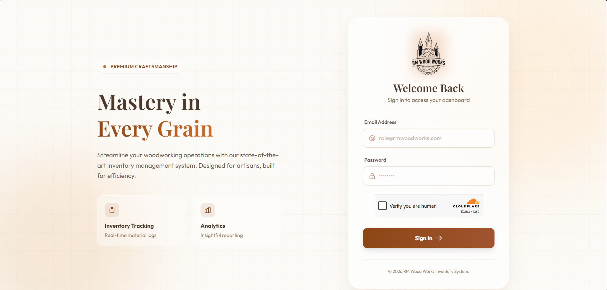
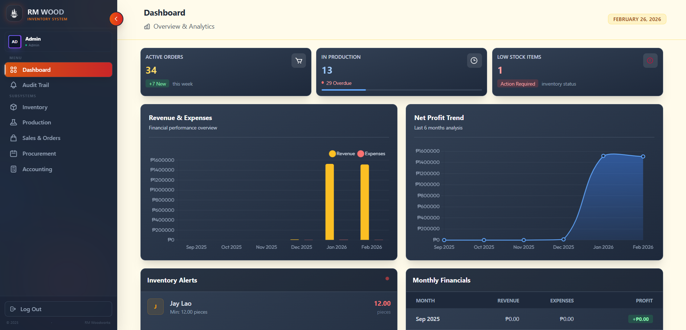
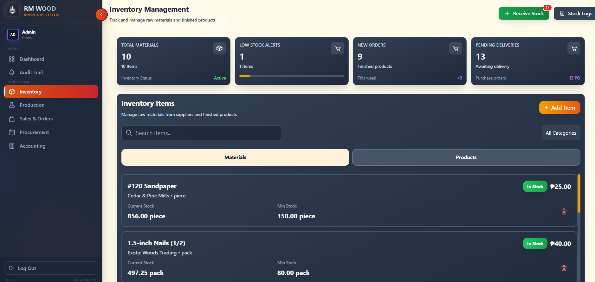
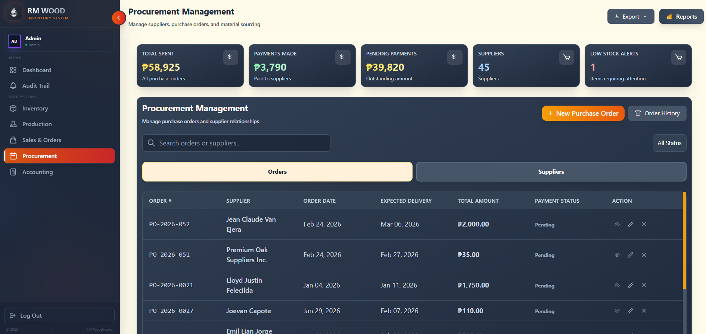
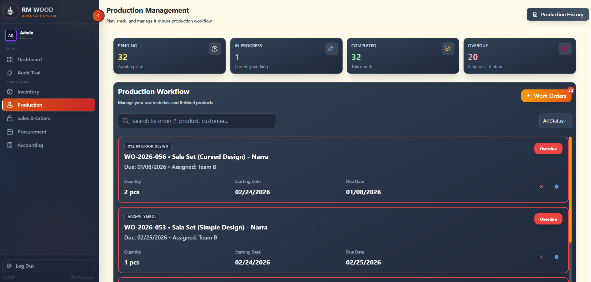
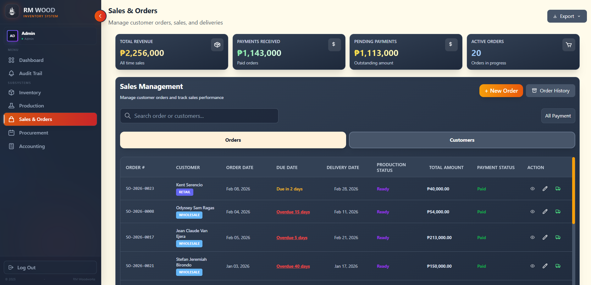
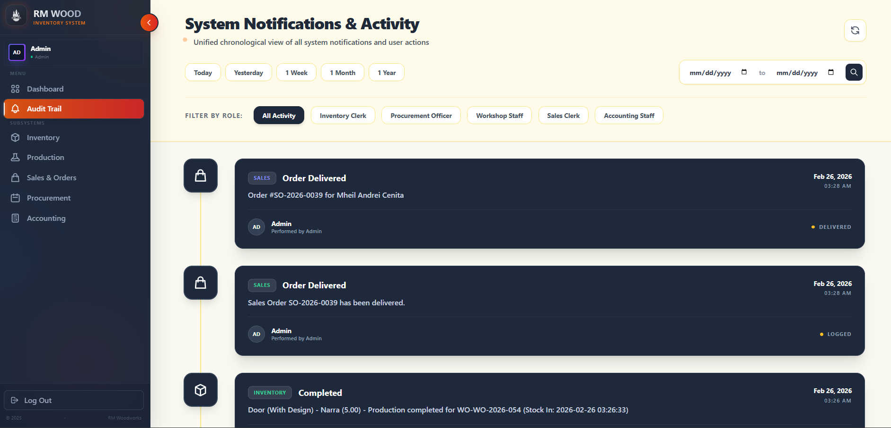

# Wood Inventory Management System

## Overview

Wood Inventory Management System is a comprehensive Laravel-based web application designed to manage the complete lifecycle of wood materials and products. It streamlines procurement, inventory tracking, sales operations, and manufacturing workflows for wood-based businesses.

## Project Summary

This system provides an integrated platform for:

- **Inventory Management**: Track wood materials and finished products with real-time inventory movements
- **Procurement**: Manage supplier relationships and purchase orders for raw materials
- **Sales Operations**: Handle customer orders and sales order management
- **Manufacturing**: Track work orders for material processing and product creation
- **Supplier & Customer Management**: Centralized database for business partners
- **Real-time Tracking**: Monitor inventory movements across different stages of operations

## Key Features

### Core Modules
- **Materials Management**: Track raw wood materials from suppliers
- **Products Management**: Manage finished products and their specifications
- **Purchase Orders**: Streamlined procurement workflow with supplier tracking
- **Sales Orders**: Efficient order management with item-level tracking
- **Work Orders**: Production tracking and manufacturing management
- **Inventory Movements**: Comprehensive logging of all inventory transactions
- **Supplier Management**: Maintain supplier information and relationships
- **Customer Management**: Track customer details and interactions
- **User Management**: Role-based access control

### Technology Stack
- **Backend**: Laravel Framework
- **Frontend**: Blade Templates with Tailwind CSS
- **Build Tool**: Vite
- **Database**: PostgreSQL/MySQL with migrations
- **Package Manager**: Composer (PHP), NPM (Node.js)
- **Testing**: PHPUnit

## Project Structure

```
wood-inventory-management/
├── app/
│   ├── Http/
│   │   └── Controllers/          # Application controllers
│   ├── Models/                   # Eloquent models for database entities
│   ├── Providers/                # Service providers
│   └── View/
│       └── Components/           # Reusable Blade components
├── resources/
│   ├── css/                      # Tailwind CSS stylesheets
│   ├── js/                       # JavaScript files
│   └── views/                    # Blade view templates
├── routes/                       # Application routing
├── database/
│   ├── migrations/               # Database schema migrations
│   ├── seeders/                  # Database seeders
│   └── factories/                # Model factories for testing
├── config/                       # Configuration files
├── tests/                        # Unit and feature tests
└── public/                       # Public assets and entry point
```

## Live Demo
[View Live Demo](https://rmwoodworks-1.onrender.com)

## Screenshots

### Login


### Dashboard


### Accounting


### Inventory


### Procurement


### Production


### Sales


### Audit Trail


## Development Status

**Status**: In Progress

## Getting Started

### Requirements
- PHP 8.0+
- Node.js 16+
- Composer
- npm or yarn
- Database (PostgreSQL/MySQL)

### Installation

1. Clone the repository
2. Install PHP dependencies: `composer install`
3. Install Node.js dependencies: `npm install`
4. Copy `.env.example` to `.env`
5. Generate application key: `php artisan key:generate`
6. Configure database connection in `.env`
7. Run migrations: `php artisan migrate`
8. Seed database (optional): `php artisan db:seed`
9. Build frontend assets: `npm run build`
10. Start development server: `php artisan serve`

### Cloudflare Turnstile (CAPTCHA)

This application uses [Cloudflare Turnstile](https://www.cloudflare.com/products/turnstile/) CAPTCHA on the login page to prevent bot attacks. Turnstile can be **toggled on or off** via the `TURNSTILE_ENABLED` flag in your `.env` file.

#### Configuration

In your `.env` file, set the following:

```env
# Set to true to enable Turnstile CAPTCHA, or false to disable it
TURNSTILE_ENABLED=false

# Your Cloudflare Turnstile keys (required when TURNSTILE_ENABLED=true)
TURNSTILE_SITE_KEY=your-site-key
TURNSTILE_SECRET_KEY=your-secret-key
```

| Setting | Effect |
|---|---|
| `TURNSTILE_ENABLED=false` | CAPTCHA is **disabled** — the widget won't render and validation is skipped. Ideal for local development. |
| `TURNSTILE_ENABLED=true` | CAPTCHA is **enabled** — the Turnstile widget appears on the login page and responses are validated server-side. Use this in production. |

After changing the value, clear the config cache:

```bash
php artisan config:clear
```

> 💡 **Tip:** Keep Turnstile **disabled** during local development (`TURNSTILE_ENABLED=false`) since Cloudflare Turnstile does not support `localhost` or `127.0.0.1` as valid hostnames. Enable it in production for security.

### Default Accounts (Seeder)

Run `php artisan db:seed` to create the following default user accounts:

| Role | Email | Password | Access |
|---|---|---|---|
| **Admin** | `admin@rmwoodworks.com` | `password` | Full access to all modules (Dashboard, Inventory, Procurement, Production, Sales, Accounting, Audit Trail) |
| **Inventory Clerk** | `inventory@rmwoodworks.com` | `password` | Inventory management |
| **Procurement Officer** | `procurement@rmwoodworks.com` | `password` | Procurement & purchase orders |
| **Workshop Staff** | `workshop@rmwoodworks.com` | `password` | Production & work orders |
| **Sales Clerk** | `sales@rmwoodworks.com` | `password` | Sales & customer orders |
| **Accounting Staff** | `accounting@rmwoodworks.com` | `password` | Accounting & financial records |

> 🔒 **Note:** Change default passwords immediately in a production environment.

### Development

- **Frontend development**: `npm run dev`
- **Run tests**: `php artisan test` or `./vendor/bin/phpunit`
- **Database reset**: `php artisan migrate:refresh`

## Models & Relationships

The system includes the following main entities:
- **User**: System users with authentication
- **Customer**: Customer information and details
- **Supplier**: Supplier information and relationships
- **Product**: Finished product catalog
- **Material**: Raw material inventory
- **PurchaseOrder**: Purchase order management
- **PurchaseOrderItem**: Line items in purchase orders
- **SalesOrder**: Sales order management
- **SalesOrderItem**: Line items in sales orders
- **WorkOrder**: Production/manufacturing orders
- **InventoryMovement**: Audit trail of inventory transactions

## Contributing

Guidelines for contributing to this project should be added here.

## License

This project is proprietary software.

